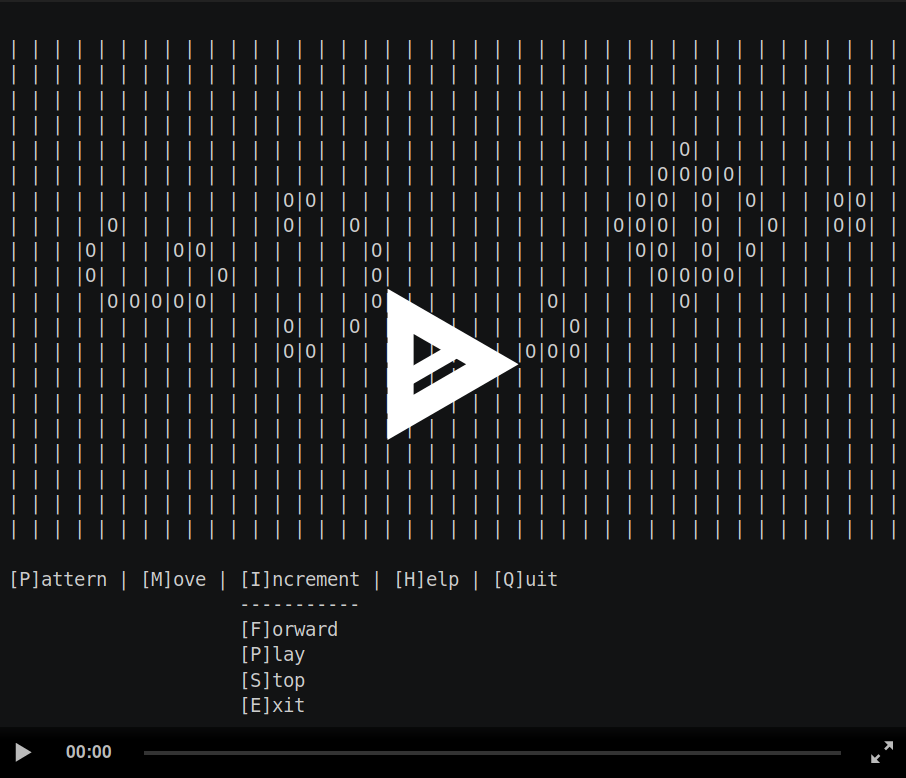

# Game of Life


# Overview
The classic programming learning assignment that displays [Conway's Game Of Life](https://en.wikipedia.org/wiki/Conway%27s_Game_of_Life) on the terminal using some ncurses

## Dependencies

```sh
sudo apt-get install build-essential
sudo apt-get install libncurses5-dev
```

## Setup

```sh
make
./gol
```

